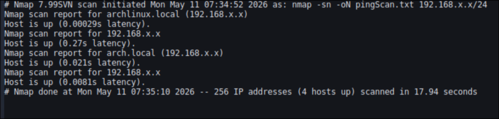
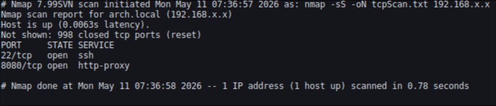
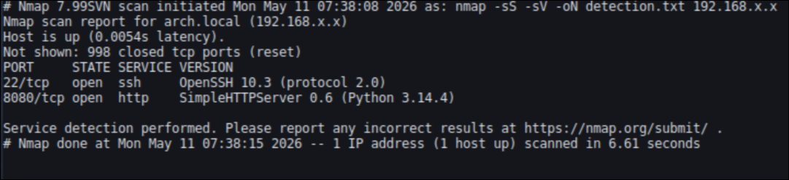
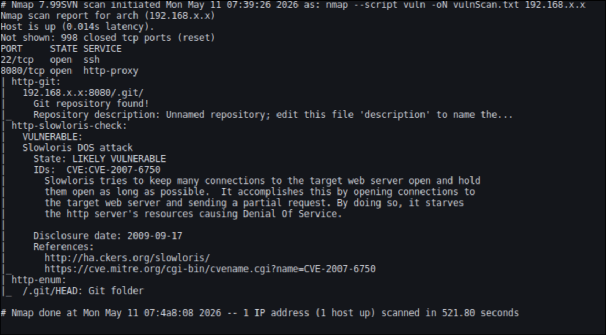

# Nmap Network Reconnaissance Lab

## Project Objective

This project demonstrates basic network reconnaissance using Nmap in a controlled home lab environment.

The goal of this lab is to perform network reconnaissance using Nmap, including:
- What devices exist on the network
- What services are exposed
- Why those services are running
- Whether they introduce potential risk

This project focuses on **thinking like a security analyst**, not just executing commands.

## Lab Environment

- **Host OS:** Arch Linux
- **Target:** Local lab machine (Linux-based system)
- **Network:** Private home network (192.168.x.x range)
- **Tool Used:** Nmap (v7.99)

⚠️ All scanning was performed only on authorized local systems, This lab is isolated and used strictly for educational cybersecurity practice.

Every scan follows this structured approach:

1. Identify live hosts
2. Discover open ports
3. Identify running services
4. Detect service versions
5. Analyze potential vulnerabilities

## Step 1: Host Discovery

### Command Used:
```bash
nmap -sn 192.168.x.x/24
```

### Output:



### Explanation:

This scan identifies active hosts on the network without performing a full port scan.
It uses ICMP echo requests and ARP requests to determine which devices are online.

### Key Questions
1. Which devices are alive?
2. How many hosts are active in the network?

## Step 2: Port Scanning 

### Command Used:
```bash
nmap -sS <target-ip>
```
### Output:



### Explanation:

This SYN scan identifies open ports on the target system.
Open ports indicate services that may be accessible and potentially vulnerable.

### Key Questions
1. What ports are open?
2. Why are these ports exposed? 

## Step 3: Service & version detection

### Command Used:
```bash 
nmap -sS -sV <target-ip>
```

### Output:



### Explanation:

This scan identifies:

Running services (SSH, HTTP, etc.)
Software versions of those services

Version detection is important because vulnerabilities are often version-specific.

### Key Questions
1. What service is running on this port?
2. Is the version outdated or secure?
3. Is this service necessary on this system?

## Step 4: Vulnerability scan 

### Command Used:

```bash
nmap --script vuln <target-ip>
```

### Output:



### Explanation:

Nmap Scripting Engine (NSE) is used to detect potential known vulnerabilities.

It does NOT confirm exploitation capabilities — it only highlights possible security risks.

### Key Questions
1. Is this vulnerability confirmed or heuristic?
2. What is the potential impact?
3. Does this require further validation?

## Key Findings Summary
- SSH (Port 22) is open for remote access
- HTTP service is running via Python SimpleHTTPServer
- Potential exposure of web interface on port 8080
- NSE scripts indicate possible misconfigurations and risk indicators

## What I Learned
- Open ports do NOT automatically mean vulnerability
- Service version detection is critical in security analysis
- Nmap is a reconnaissance tool, not an exploitation tool
- Real analysis comes from interpretation, not commands

## Limitations
- Results may include false positives
- NSE scripts are heuristic-based
- No exploitation was performed in this project
- Further manual testing would be required for validation

## Conclusion

This project demonstrates foundational network reconnaissance skills using Nmap.

It focuses on:
- Understanding attack surface discovery
- Interpreting scan results
- Thinking like a security analyst rather than just executing tools

This is the first step toward advanced penetration testing workflows such as traffic analysis, web exploitation, and full attack chain simulation.
