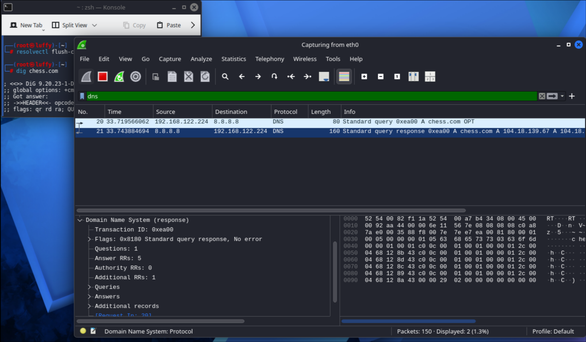
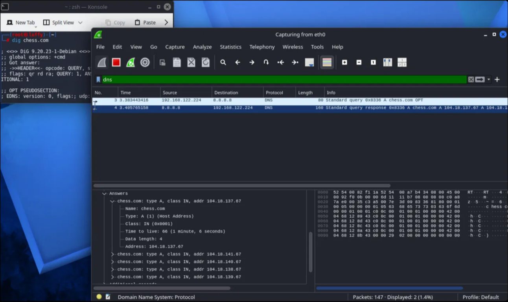
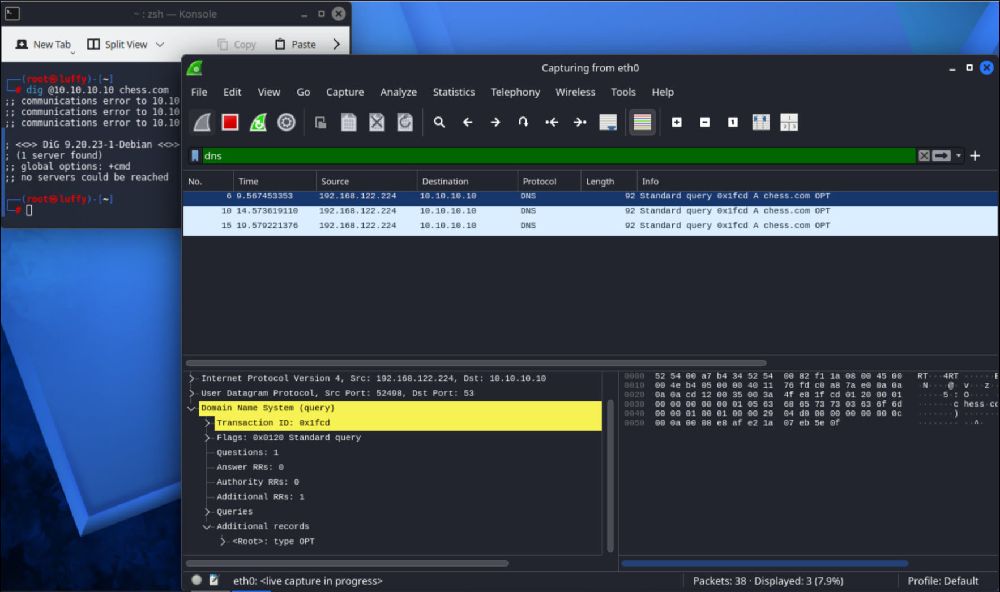
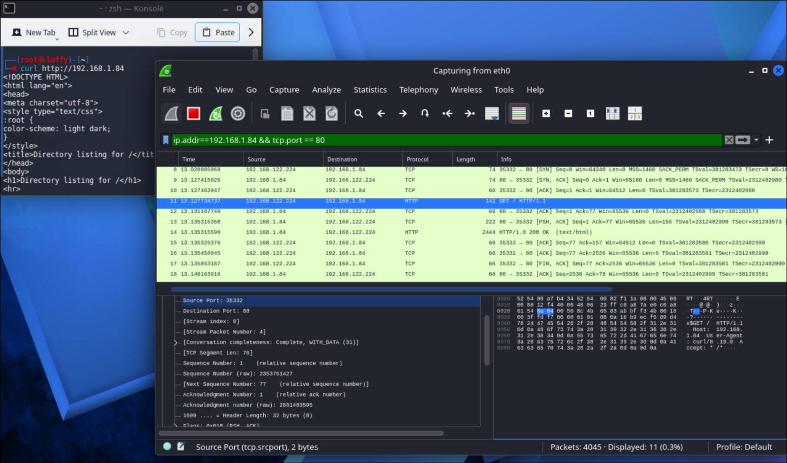
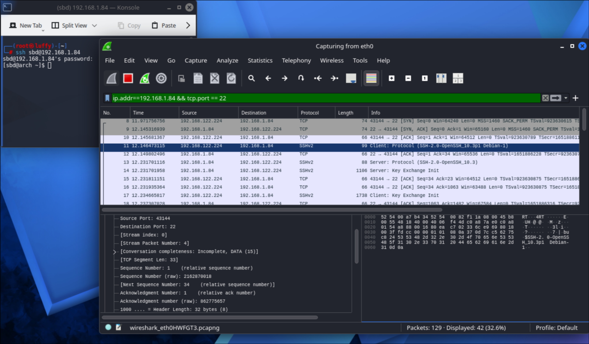
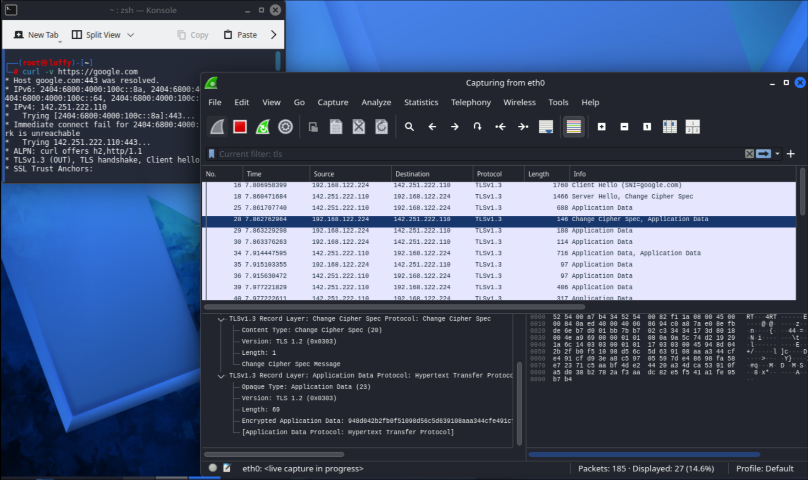
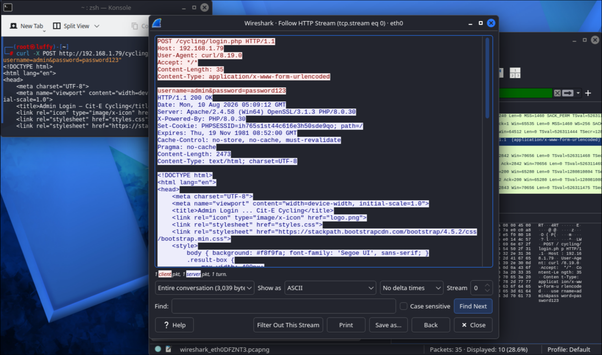

# Network Traffic Analysis with Wireshark

## Project Objective

This project demonstrates packet-level analysis of TCP connections, DNS resolution, TLS negotiation, and HTTP traffic using Wireshark across a multi-machine home lab.

The goal of this lab is to observe and interpret network traffic at the packet level, including:
- How DNS resolves domain names and what happens when it fails
- How a TCP connection is established before any application data flows
- How TLS negotiates encryption, and what remains visible despite it
- Why HTTP transmits data in plaintext, and what that exposes
- How SYN scans and Connect scans differ at the packet level
- How open, closed, and filtered port states actually appear on the wire

This project focuses on **interpreting protocol behavior**, not just running captures.

---

## Lab Environment

| Device | Role | OS | IP (typical) |
|---|---|---|---|
| Kali Linux VM | Attacker/analysis machine | Kali (QEMU/KVM, NAT) | 192.168.122.224 |
| Arch Linux laptop #1 | Target (TCP/DNS/scan tests) | Arch Linux | 192.168.1.84 |
| Windows laptop | Target (HTTP login demo) | Windows 11 | 192.168.1.7x (DHCP, check `ipconfig`) |

⚠️ All traffic captured is between machines I own, in an isolated/private home lab. No third-party traffic, real credentials, or unauthorized targets were involved. This lab is used strictly for educational cybersecurity practice.

---

## Methodology Note

Every packet-flow diagram in this document (e.g. `SYN → SYN,ACK → RST`) was written to match what actually appeared in my own Wireshark captures, not copied from generic textbook descriptions. In a few cases the real behavior differed from the simplified theory I started with — for example, closed ports responded with `RST, ACK` rather than a bare `RST`, and SYN scan vs. Connect scan classified an identical ICMP "port unreachable" response differently (filtered vs. closed, see Step 5 and Step 6). Where this happened, the diagrams and explanations below reflect the observed behavior, with the discrepancy called out explicitly rather than smoothed over.

---

## Setup Reference (for future me)

### Kali VM
- Wireshark and nmap pre-installed
- Capture interface: `eth0` (QEMU/KVM virtual NIC, MAC prefix `52:54:00:...` — not physical hardware)
- Standard capture filter used throughout: `ip.addr==<target-ip> && tcp` (or `dns` / `tls` / `http` depending on section), narrowed further with `tcp.port==<port>` as needed

### Arch Linux target laptop
```bash
# Plain HTTP test server (used for TCP handshake + HTTP sections)
python3 -m http.server

# SSH — just needs sshd running (systemctl enable/start sshd)
# connected to from Kali via:
ssh sbd@192.168.1.84

# Simulating a closed port — nothing needed, just scan an unused port

# Simulating a filtered port (silent drop)
sudo iptables -A INPUT -p tcp --dport 8888 -j DROP
# cleanup:
sudo iptables -D INPUT -p tcp --dport 8888 -j DROP

# Simulating a filtered port (ICMP reject) — must remove the DROP rule first,
# since iptables matches top-to-bottom and DROP would otherwise shadow this rule
sudo iptables -A INPUT -p tcp --dport 8888 -j REJECT --reject-with icmp-port-unreachable
# cleanup:
sudo iptables -D INPUT -p tcp --dport 8888 -j REJECT --reject-with icmp-port-unreachable

# Check current rules any time:
sudo iptables -L INPUT -n --line-numbers
```

### Windows laptop (XAMPP target — HTTP login demo)
1. Start Apache + MySQL via XAMPP Control Panel
2. Import project database via phpMyAdmin (`http://localhost/phpmyadmin`)
3. Confirm local access works first: browser → `http://127.0.0.1/cycling/index.html`
   (use `127.0.0.1`, not `localhost` — avoids browser HTTPS auto-upgrade/HSTS issues)
4. Find LAN IP: `ipconfig` → note the IPv4 address
5. **Critical/easy-to-miss step:** confirm the network profile is **Private**, not Public —
   a Public profile silently ignores firewall allow-rules regardless of whether they exist:
   ```powershell
   Get-NetConnectionProfile
   # if it shows "Public":
   Set-NetConnectionProfile -InterfaceAlias "Wi-Fi" -NetworkCategory Private
   ```
6. Allow inbound port 80 (Private profile only, not Public):
   `wf.msc` → Inbound Rules → New Rule → Port → TCP 80 → Allow → check **Private** only → name it clearly (e.g. `XAMPP-Lab-Temp`) → delete this rule after the project is done
7. Confirm Apache's `Listen` directive isn't restricted to `127.0.0.1` only, in
   `C:\xampp\apache\conf\httpd.conf` — should just read `Listen 80`

**Troubleshooting order if `curl` from Kali can't connect (in this order):**
Apache actually running → Apache listening on all interfaces, not just localhost → Network profile is Private → firewall rule exists and is enabled → correct IP/path typed.

---

## Step 1: DNS Resolution

### 1a. Query and Response

**Command Used:**
```bash
dig chess.com
```

**Output:**


**Explanation:**
DNS resolves the domain name using a single UDP request/response exchange (no handshake, unlike TCP). Both packets share Transaction ID `0x8336`. The response's Answer section shows a DNS TTL of 66 seconds (distinct from the IP header's TTL, which controls hop count, not caching) and returns five different A records for chess.com — CDN-style load balancing.

**Key Questions**
1. What Transaction ID links the query to its response?
2. What TTL was returned, and what does it control?
3. Why does one domain return multiple IP addresses?

### 1b. Caching Behavior

**Command Used:**
```bash
resolvectl flush-caches
dig chess.com
dig chess.com
```

**Output:**


**Explanation:**
Contrary to expected caching behavior, both `dig` calls generated separate DNS queries on the wire, visible as two distinct query/response pairs with different Transaction IDs (0xea00, 0x9d82). `dig` queries systemd-resolved's local stub listener (127.0.0.53), which then forwards upstream — confirmed via `resolvectl status` showing `Current DNS Server: 8.8.8.8`. The exact reason caching did not occur at the stub layer was not further diagnosed in this lab, but is a reasonable next step for investigation.

**Key Questions**
1. What would confirm whether a local caching resolver is active? (`resolvectl status`, `resolvectl statistics`)
2. How would this capture differ on a system with confirmed active local caching?

### 1c. DNS Failure

**Command Used:**
```bash
dig @10.10.10.10 chess.com
```

**Output:**


**Explanation:**
Pointing resolution at an invalid DNS server (`10.10.10.10`) results in the query going out repeatedly (visible as retransmissions with the same Transaction ID, `0x1fcd`) with no response ever returned, ending in "communications error" / "no servers could be reached." This demonstrates that DNS is a single point of dependency for name resolution — the network path itself is unaffected, only the ability to translate names to IPs.

**Key Questions**
1. Did the query receive any response, or time out completely?
2. What does this reveal about DNS's role versus general network connectivity?

---

## Step 2: TCP Three-Way Handshake

### 2a. Plain HTTP (curl)

**Setup:** `python3 -m http.server` running on the target.

**Command Used:**
```bash
curl http://192.168.1.84
```

**Output:**


**Explanation:**
Before any HTTP data is exchanged, the client and server complete a TCP three-way handshake (SYN, SYN-ACK, ACK) on port 80. The GET request in this capture carries 76 bytes; the server's ACK increases by exactly 76 (relative Seq 1 → Ack 77), confirming TCP tracks data by byte position, not packet count.

**Key Questions**
1. Why does HTTP wait for the handshake before sending data?
2. Why does the ACK number increase by exactly the payload length?

### 2b. SSH

**Command Used:**
```bash
ssh sbd@192.168.1.84
```

**Output:**


**Explanation:**
The same SYN → SYN-ACK → ACK pattern occurs before SSH's own protocol banner exchange begins (`SSH-2.0-OpenSSH_10.3p1`). This confirms TCP's handshake is protocol-agnostic — HTTP and SSH both rely on the identical underlying connection setup.

**Key Questions**
1. What happens immediately after the ACK in this capture?
2. Is the handshake itself encrypted?

---

## Step 3: TLS Handshake

**Command Used:**
```bash
curl -v https://google.com
```

**Output:**


**Explanation:**
This capture shows a TLS 1.3 handshake: Client Hello (with SNI = `google.com`, sent in plaintext even though the session becomes encrypted), Server Hello combined with Change Cipher Spec, followed by Application Data in both directions. From that point forward, payload is encrypted and unreadable — confirmed by the `Encrypted Application Data` field showing raw ciphertext, even though Wireshark can still identify the underlying protocol as HTTP from context.

Note: despite negotiating TLS 1.3, individual record layers still report `Version: TLS 1.2 (0x0303)` — this is expected TLS 1.3 behavior for backward compatibility with middleboxes, not an inconsistency.

**Key Questions**
1. What information is visible in the Client Hello even though the session is encrypted?
2. Why can Wireshark identify the encrypted data as HTTP without reading its contents?
3. Why might TLS 1.3 handshakes appear shorter than TLS 1.2?

---

## Step 4: HTTP Request & Response — Credential Exposure

**Setup:** The Cit-E Cycling project (a PHP/MySQL admin login system built for coursework) was hosted locally via XAMPP on the Windows lab machine. The project's seeded placeholder test account (username: `admin`, password: `password123` — coursework dummy data, not a real credential) was used to demonstrate the login flow. Full setup steps are in the Setup Reference section above.

**Command Used:**
```bash
curl -X POST http://192.168.1.79/cycling/login.php -d "username=admin&password=password123"
```

**Wireshark:** filter `http` → find the `POST /cycling/login.php` packet → right-click → **Follow → HTTP Stream**

**Output:**


**Explanation:**
Following the stream shows the complete POST request in plaintext, including `username=admin&password=password123`, exactly as it would appear to anyone capturing traffic on the same network path. The server's `200 OK` response confirms the login succeeded. Note this differs from a true man-in-the-middle scenario (e.g. ARP spoofing) — here, the request was generated by the same machine doing the capturing, demonstrating that HTTP data is plaintext in transit, not that traffic was intercepted from a third party.

An additional finding, unrelated to the network capture: the application's `user` table stores passwords in plaintext with no hashing, meaning even a database compromise (separate from network interception) would expose credentials directly. This compounds the risk shown by the HTTP capture — the credential is exposed both in transit and at rest.

**Key Questions**
1. What HTTP method and Content-Type carried the credentials?
2. Would HTTPS alone have fully solved the security problem here, given the plaintext storage on the server side?
3. What's the difference between "secure in transit" and "secure at rest," and why does a real application need both?

---

## Step 5: SYN Scan (`-sS`) — Half-Open

### Open Port
**Command:** `nmap -sS 192.168.1.84` (port 22 reported open)
.png)
```
SYN            client → 22
SYN, ACK       server → client
RST            client → server   (client tears down, no ACK — the "half-open" behavior)
```

### Closed Port
**Command:** `nmap -sS -p 9999 192.168.1.84`
.png)
```
SYN            client → 9999
RST, ACK       server → client   (immediate rejection — observed as RST,ACK, not a bare RST)
```

### Filtered Port — silent drop
**Setup:** `sudo iptables -A INPUT -p tcp --dport 8888 -j DROP`
**Command:** `nmap -sS -p 8888 192.168.1.84`
.png)
```
SYN            client → 8888   (retransmitted, no reply)
```

### Filtered Port — ICMP rejection
**Setup:** `sudo iptables -A INPUT -p tcp --dport 8888 -j REJECT --reject-with icmp-port-unreachable`
**Command:** `nmap -sS -p 8888 192.168.1.84`
.png)
```
SYN            client → 8888
ICMP           server → client   (Destination Unreachable - Port Unreachable)
```
nmap reports this as **filtered**.

**Key Questions**
1. Why does SYN scan not require completing the handshake?
2. Why does nmap treat silence and ICMP rejection the same way for this technique?
3. What advantage does this give SYN scan over Connect scan?

---

## Step 6: TCP Connect Scan (`-sT`) — Full Handshake

### Open Port
**Command:** `nmap -sT 192.168.1.84` (port 22 open)
.png)
```
SYN            client → 22
SYN, ACK       server → client
ACK            client → server   (handshake completes, unlike SYN scan)
RST, ACK       client → server   (connection closed)
```

### Closed Port
**Command:** `nmap -sT -p 9999 192.168.1.84`
.png)
```
SYN            client → 9999
RST, ACK       server → client
```
Identical to the SYN scan closed-port result — active rejection looks the same regardless of technique.

### Filtered Port — silent drop
.png)
```
SYN            client → 8888   (retransmitted, no reply)
```
Same as SYN scan: retransmitted SYNs, no reply, reported **filtered**.

### Filtered Port — ICMP rejection
.png)
```
SYN            client → 8888
ICMP           server → client   (Destination Unreachable - Port Unreachable)
```
**Key finding:** with the identical ICMP response, Connect scan reports this port as **closed**, not filtered — the opposite of SYN scan's classification for the same underlying network condition. This is because SYN scan inspects raw packets directly, while Connect scan relies on the OS socket API's `connect()` return value, and the two interpret an ICMP port-unreachable response differently.

**Key Questions**
1. Why does Connect scan need the extra ACK packet that SYN scan skips?
2. Why did the same ICMP response get classified differently between the two techniques?
3. When would Connect scan be preferred over SYN scan?

---

## Key Findings Summary
- TCP's three-way handshake precedes HTTP, HTTPS, and SSH identically — it's protocol-agnostic
- Sequence and acknowledgment numbers track byte position, not packet count — confirmed directly against a captured 76-byte GET request
- DNS uses a single UDP exchange with no handshake, and depends entirely on a reachable resolver — losing DNS breaks name resolution without affecting underlying connectivity
- TLS hides content but not metadata: the SNI hostname in the Client Hello is visible in plaintext even in an otherwise fully encrypted session
- HTTP transmits everything, including credentials, in plaintext — demonstrated directly against a real login form
- SYN scan and Connect scan produce identical results for open and closed ports, but classify the same ICMP "port unreachable" response differently — SYN scan reports filtered, Connect scan reports closed
- Silent packet drops and explicit ICMP rejections both result in nmap reporting "filtered" under SYN scan, but only differ visibly at the packet level
- Real captured behavior occasionally diverged from simplified theory (e.g. `RST, ACK` instead of a bare `RST` for closed ports) — documented as observed, not smoothed over to match the textbook version

## What I Learned
- TCP is fundamentally a byte-stream protocol, not a packet-counting protocol
- Network position (e.g. controlling a switch) only grants visibility into traffic — it does not grant the ability to decrypt TLS, which depends on possessing the actual session keys, not network placement
- Nmap's scan techniques don't just differ in speed — they can produce different state classifications for the exact same underlying network condition
- Troubleshooting cross-machine connectivity requires isolating each layer independently (server running? listening on the right interface? firewall rule present? network trust profile correct?) rather than guessing at the whole stack at once
- Wireshark reveals distinctions that a tool's own summary output abstracts away

## Limitations
- Captures against `google.com` and `chess.com` involve public internet destinations, not the isolated lab, since DNS resolution and TLS require external infrastructure — no personal accounts or credentials were involved in those, only public domain lookups and anonymous HTTPS connections
- All other captures (TCP handshake, HTTP login, SYN/Connect scans) were performed entirely within my own private home lab, against machines I own
- IP and MAC addresses shown throughout are private-range and/or VM-generated, not identifying
- The HTTP credential-exposure demo used seeded placeholder coursework data (`admin` / `password123`), not a real account

## Conclusion

This project demonstrates the ability to read and interpret DNS, TCP, TLS, and HTTP behavior directly from packet captures, across a multi-machine home lab spanning Linux and Windows targets.

It focuses on:
- Understanding protocol behavior at the byte level, not just at the level of a tool's summary output
- Comparing scan techniques by their actual packet behavior, including an edge case (filtered vs. closed classification) not obvious from nmap's own output
- Demonstrating a real, concrete security consequence (plaintext credential exposure) against a self-built application, tying together the networking concepts with an applied security finding

This builds directly on the reconnaissance skills from the Nmap project and completes the network-analysis foundation ahead of web application penetration testing with Burp Suite.
